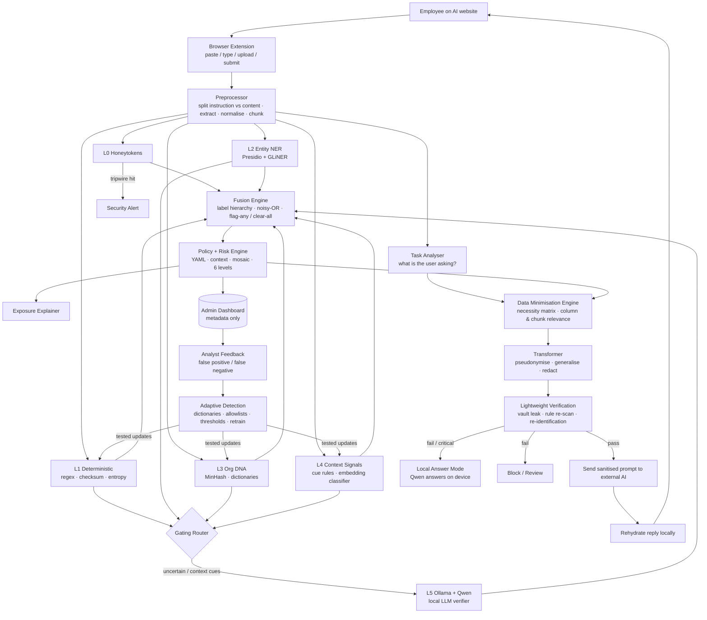

# VeilAI — Local AI Privacy Firewall

> **Keep sensitive data local, understand its context, send only what the task needs, verify it, and only then let it reach external AI.**
>
> *Working name. Replace with your team's final product name.*

**Contents**
1. Problem · 2. Target Users · 3. Stakeholders · 4. Current Gap · 5. Opportunity
6. Research: Existing Solutions vs VeilAI · 7. Our Benchmark Evidence
8. Solution Overview & Design Principles · 9. How It Works (Input → Intelligence → Decision → Action)
10. Architecture · 11. Component Details · 12. Key Technology
13. Why This Tech Stack · 14. Securing the Firewall Itself · 15. Evaluation Plan
16. Innovation, Feasibility & Impact · 17. Build Plan · 18. Limitations

---

## 1. Problem

- Employees paste documents, code, customer data and financials into public AI tools (ChatGPT, Claude, Gemini, Copilot) to summarise, write code and analyse information.
- Once submitted, the data **leaves the organisation's control**. It cannot be recalled, audited or deleted.
- Organisations have **no visibility** into what is shared, by whom, or with which AI tool.
- Banning AI doesn't work. Employees move to personal devices and accounts ("shadow AI"), which means even less visibility.
- Traditional DLP was built for email, files and networks, not for text pasted into a browser chat box.
- Pattern tools catch emails and API keys, but miss **context**. This sentence contains no pattern, yet it is highly confidential:

> "The board has approved confidential acquisition negotiations with Company X."

**Core problem:** *Detect and neutralise sensitive organisational information before it reaches an external AI service, without blocking productivity, and without sending the data anywhere else to check it.*

---

## 2. Target Users

| User | Need |
|---|---|
| Employees / knowledge workers | Use AI safely without worrying about accidental leaks |
| Developers | Paste code and logs without exposing secrets, keys or internal hosts |
| Security / SOC analysts | Visibility, alerts and a way to correct the system |
| Compliance / legal | Evidence of controls under DPDP Act 2023, GDPR, PCI-DSS |
| HR / team managers | Protect salary, performance and personal data of staff |

---

## 3. Stakeholders

- **Primary:** employees (end users) and the security / IT team (administrators and analysts)
- **Decision makers:** CISO, CIO, Data Protection Officer
- **Governance:** legal, compliance, risk, internal audit
- **Indirect beneficiaries:** customers and partners whose data is protected
- **External:** regulators (e.g., Data Protection Board of India) and AI vendors

---

## 4. Current Gap

| Current approach | Why it fails |
|---|---|
| Blanket AI bans | Kill productivity and push people towards shadow AI |
| Traditional DLP | Doesn't inspect browser chat input |
| Regex-only browser extensions | Miss organisational content: strategy, IP, financials |
| LLM gateways / proxies | Protect in-house apps only, not public AI websites |
| Cloud-based scanners | Sending the prompt out for checking is itself a leak |
| LLM-only local detection | **Our benchmark: misses 54–63% of sensitive documents (§7)** |
| Blunt redaction | Output becomes useless, so users switch the tool off |
| "Redacted = safe" | Nobody verifies that the transformation actually worked |
| Static rules | Never learn the company's own terms, projects and false alarms |

**Key insight:** existing tools detect *generic patterns* one message at a time. None of them know what **this company's** secrets look like, send only **what the task needs**, or **learn** from the security team's decisions.

---

## 5. Opportunity

- AI adoption at work is growing faster than the controls around it.
- DPDP Act 2023 and GDPR raise the cost of personal-data leaks.
- Open-source components (Ollama, Qwen, Presidio, GLiNER, sentence embeddings) can now run on an **ordinary employee laptop**, fully offline.
- A tool that is **local, explainable, measurable and productivity-friendly** can become the safe default route to AI instead of a blocker.

---

## 6. Research: Existing Solutions vs VeilAI

### 6.1 What exists (open-source projects reviewed on GitHub)

| Type | Examples | What they do |
|---|---|---|
| Regex browser extensions | Chainstack DLP, PasteSafe, cloakprompt | Mask API keys, emails, cards before sending to ChatGPT |
| ML browser extension | PrivacyFirewall | Regex + in-browser BERT NER; block or warn on paste |
| LLM gateways / libraries | LLM Guard, PrivAI Guard, prompt-sentinel, CleanPrompt | Scan prompts for PII and secrets inside apps; some restore values in replies |
| Shadow-AI auditors | Shadow-AI (policy & compliance auditor) | Keyword indicators for code, contracts, M&A; risk score; metadata logging |

### 6.2 Comparison

✅ = supported · ⚠️ = partial · ❌ = not found in public documentation (as reviewed; projects may change)

| Capability | Regex extensions | PrivacyFirewall | LLM Guard / gateways | Shadow-AI auditor | LLM-only (our baseline) | **VeilAI** |
|---|---|---|---|---|---|---|
| Works on public AI websites | ✅ | ✅ | ❌ app-level | ✅ | ⚠️ | ✅ |
| 100% local analysis | ✅ | ✅ | ✅ self-hosted | ⚠️ | ✅ | ✅ |
| Secrets & IDs (with checksums) | ⚠️ regex | ⚠️ regex | ✅ | ✅ | ✅ 90–95% | ✅ |
| Indian IDs (Aadhaar, PAN, GSTIN, UPI) | ❌ | ❌ | ❌ | ⚠️ | ⚠️ | ✅ |
| Contextual confidentiality | ❌ | ❌ | ⚠️ topic bans | ⚠️ keywords | ⚠️ 11–26% | ✅ ensemble |
| Company-specific knowledge (Org DNA) | ❌ | ❌ | ❌ | ❌ | ❌ | ✅ |
| Honeytoken tripwires | ❌ | ❌ | ❌ | ❌ | ❌ | ✅ |
| Task-aware data minimisation | ❌ | ❌ | ❌ | ❌ | ❌ | ✅ |
| Pseudonymise + restore reply | ⚠️ | ❌ | ✅ | ❌ | ❌ | ✅ |
| Verifies the sanitised output | ❌ | ❌ | ❌ | ❌ | ❌ | ✅ |
| Explains business / legal exposure | ❌ | ⚠️ highlight | ❌ | ⚠️ evidence | ⚠️ | ✅ |
| Session (mosaic) risk | ❌ | ❌ | ❌ | ❌ | ❌ | ✅ |
| Learns from analyst feedback | ❌ | ⚠️ settings | ❌ | ❌ | ❌ | ✅ |
| Answer locally instead of blocking | ❌ | ❌ | ❌ | ❌ | ❌ | ✅ |
| Published benchmark | ❌ | ❌ | ⚠️ | ❌ | ✅ | ✅ |

---

## 7. Our Benchmark Evidence (LLM-only test)

**Setup:** 192 synthetic documents (147 sensitive, 45 safe, including 10 safe look-alikes and 37 hard contextual cases). CPU only: Intel Core Ultra 5 125H, 16 GB RAM, Ollama, Q4 models.

### 7.1 Overall

| Metric | Qwen3 1.7B | Qwen3 4B Instruct |
|---|---|---|
| Recall (sensitive caught) | 37.4% | 45.6% |
| Precision | 93.2% | 95.7% |
| False negative rate | 62.6% (92 missed) | 54.4% (80 missed) |
| False positive rate | 8.9% | 6.7% |
| Hard-case recall | 18.9% | 24.3% |
| Invalid JSON | 0 | 0 |
| Avg time per short doc | 6.4 s | 8.0 s |
| 15-page doc | 296 s (failed: output limit) | 208 s (missed) |

### 7.2 By category

| Category | Docs | 1.7B | 4B |
|---|---|---|---|
| CREDENTIALS | 21 | 90.5% | 95.2% |
| CUSTOMER_INFORMATION | 26 | 69.2% | 69.2% |
| PERSONAL_INFORMATION | 29 | 58.6% | 58.6% |
| SECURITY | 35 | 62.9% | 20.0%* |
| INTELLECTUAL_PROPERTY | 27 | 11.1% | 25.9% |
| CONFIDENTIAL_BUSINESS | 33 | 24.2% | 24.2% |
| FINANCIAL | 32 | 18.8% | 12.5% |

\* Labelling effect: the 4B tags keys and passwords as CREDENTIALS only, not also SECURITY.

### 7.3 Long documents
One sensitive sentence was hidden about 60% of the way through each document. Both models caught it in the 1-page document. **Neither reliably caught it in the 5, 10 or 15-page documents.** Time grows by roughly 25–35 s per 1,000 prompt tokens on CPU.

### 7.4 What this proves → design decisions

| Finding | Decision |
|---|---|
| High precision, low recall: the model is cautious, not confused | Add more detectors: any detector can flag (§8, principle 3) |
| Credentials already 90–95% | Deterministic rules own secrets; the LLM only confirms |
| Financial, business, IP at 11–26% | Dedicated context signals, Org DNA, honeytokens |
| Long documents missed after page 1 | Always scan in ~1-page chunks |
| Whole-document scans take minutes | Gating router: the LLM runs only on chunks that need it |
| SECURITY label mismatch | Label hierarchy in fusion (CREDENTIALS ⇒ SECURITY) |
| 1.7B returns findings on safe docs | Decisions use the fused verdict, never raw LLM findings |

**Pitch line:** *"We benchmarked the LLM-only approach, found exactly where it fails, and built a detector for each failure."*

---

## 8. Solution Overview & Design Principles

**VeilAI** is a pre-submission privacy firewall that runs entirely on the employee's device. Framework: **P.A.S.S. — Perceive → Assess → Sanitise → Safeguard.**

### Design principles
1. **Local only.** All analysis uses on-device models. No external AI or cloud API is ever used by VeilAI itself.
2. **Minimise before masking.** First remove what the task doesn't need; then pseudonymise what remains.
3. **Flag on any, clear on all.** Any detector can raise risk. Content is SAFE only when every detector agrees.
4. **Models detect; policy decides.** The organisation's YAML policy sets what each category means.
5. **Never trust redaction without checking it.** Every sanitised output passes a fast verification.
6. **Uncertain is never SAFE.** Uncertainty goes to REVIEW.
7. **Protect without surveillance.** Admins see metadata, never prompt content.

### What it does
1. **Captures** prompts, pastes and uploads before they reach an AI tool
2. **Understands the task** the user is asking the AI to do
3. **Detects** sensitive content with a 6-layer local ensemble (including Ollama + Qwen and honeytokens)
4. **Assesses** risk using policy, severity, confidence and session history
5. **Explains** each exposure in plain language with evidence
6. **Minimises** data to what the task needs (Data Minimisation Engine)
7. **Transforms** what remains (pseudonymise, generalise, redact)
8. **Verifies** the sanitised output
9. **Releases** it, **answers locally**, blocks, or sends it to review
10. **Restores** real values in the AI's reply, on the device
11. **Learns** from analyst feedback (Adaptive Detection)

---

## 9. How It Works — Input → Intelligence → Decision → Action

### ① INPUT (Perceive: capture)
1. **Capture:** the browser extension intercepts paste, typing (debounced), file upload and submit on AI websites. The dashboard also accepts document uploads.
2. **Split:** the user's **instruction** ("summarise Q4 trends") is separated from the **content** (pasted text or file).
3. **Extract:** text from PDF, DOCX, CSV/XLSX and code. OCR is used only for images.
4. **Normalise:** fold Unicode homoglyphs, strip zero-width characters, decode base64 and hex. This defeats evasion tricks.
5. **Chunk:** split into ~1-page chunks (500–800 tokens), keeping page numbers for evidence.
6. **Context:** record the destination AI tool, account type, user role and session history.

### ② INTELLIGENCE (Perceive: understand and detect)
1. **Task analyser:** classifies the instruction (summarise, analyse data, debug code, draft, translate, Q&A).
2. **Detection ensemble:** six detectors run on each chunk:

| Layer | Detects | Method | Speed |
|---|---|---|---|
| L0 Honeytokens | Planted fake secrets and IDs | Exact hash match | < 1 ms |
| L1 Deterministic | Keys, passwords, Indian IDs, cards, internal IPs and hosts | Regex, entropy, checksums | ~1 ms |
| L2 Entity NER | People, organisations, addresses, customer IDs | Presidio + GLiNER | 30–80 ms |
| L3 Org DNA | The company's own confidential documents and names | MinHash fingerprints, dictionaries | ~5 ms |
| L4 Context signals | Financial, strategic, IP content | Cue rules + embedding classifier | ~20 ms |
| L5 **Ollama + Qwen** | Meaning-dependent confidentiality | Local LLM, per chunk, gated | 3–20 s |

3. **Gating router:** decides which chunks need L5 (see §11.3).

### ③ DECISION (Assess)
1. **Fusion:** merge duplicate findings, apply the label hierarchy, combine confidence with noisy-OR.
2. **Policy:** YAML rules map category + context to severity and action.
3. **Risk:** apply context multipliers (destination, volume, combination bonus) and session mosaic risk.
4. **Level:**

| Level | Meaning | Default action |
|---|---|---|
| SAFE | Nothing meaningful found, all layers agree | Allow |
| LOW | Minor sensitivity | Allow + nudge |
| MEDIUM | Potentially sensitive | Minimise + transform |
| HIGH | Confidential | Minimise + transform, or local answer |
| CRITICAL | Secrets, honeytokens, highly sensitive data | Block + alert, or local answer |
| REVIEW | Layers disagree or are uncertain | Send sanitised version, or justify |

### ④ ACTION (Sanitise → Safeguard)
1. **Explain:** what was found, where, why it matters, which regulation applies, what to do.
2. **Minimise:** the Data Minimisation Engine removes what the task doesn't need.
3. **Transform:** pseudonymise, generalise or redact what remains.
4. **Verify:** vault leak check + fast rule re-scan + re-identification check.
5. **Decide:** send sanitised · answer locally · block · review.
6. **Rehydrate:** restore real values in the AI's reply, on the device.
7. **Log:** metadata only goes to the dashboard (category, level, tool, time, department).
8. **Learn:** analyst decisions update rules, dictionaries and thresholds.

---

## 10. Architecture



**Slide version**

```
 USER ─► EXTENSION ─► PREPROCESS ─► TASK ANALYSER
                          │
                          ▼
   DETECTION ENSEMBLE (local): L0 Honeytokens · L1 Rules · L2 NER · L3 Org DNA · L4 Context
                          │                └─ Gating Router ─► L5 Ollama + Qwen
                          ▼
   FUSION ─► POLICY + RISK ─► EXPLAIN ─► DATA MINIMISATION ─► TRANSFORM ─► VERIFY
                                                                             │
                     ┌───────────────────────────┬───────────────────────────┤
                     ▼                           ▼                           ▼
            Send sanitised ─► AI         Local answer (Qwen)          Block / Review
                     │
                     ▼
            Rehydrate reply ─► USER

   Metadata ─► DASHBOARD ─► Analyst feedback ─► Adaptive Detection ─► back into L1/L3/L4
   Honeytoken hit ─► instant alert
   [ Everything except the external AI runs on the employee's device ]
```

---

## 11. Component Details

### 11.1 L0 — Honeytoken Detection

**What:** fake but realistic secrets planted inside the organisation as tripwires. They look real, work nowhere, and only VeilAI knows them. If one appears in a prompt, the text was almost certainly copied from a protected system.

**How to build it:**
1. The admin generates honeytokens in the dashboard:
   - fake API keys in the organisation's real key format
   - fake customer IDs, employee IDs, document IDs
   - fake project codenames
   - unique "canary sentences" inside confidential documents
2. Each token carries a hidden checksum (HMAC with an org secret), so VeilAI can recognise it without false matches.
3. The admin plants each token in a specific place (a repository config, a CRM row, a board deck). The dashboard records **where** each one was planted.
4. Endpoints receive only **hashes** of the tokens, never the list itself.
5. During a scan, L0 hashes candidate strings and checks them against the list.
6. **On a match:** risk becomes CRITICAL, the request is blocked, and an alert names the source ("token planted in the finance-reports repo").

**Why it matters:** a honeytoken match has almost zero false positives, and it tells the security team *which system leaked*.

### 11.2 L1–L4 — Fast detectors

| Layer | How to build | Instructions |
|---|---|---|
| **L1 Deterministic** | detect-secrets + gitleaks rule set; custom Indian ID validators | Luhn for cards, Verhoeff for Aadhaar, format rules for PAN/GSTIN/IFSC/UPI; Shannon entropy > ~4.0 on long tokens; internal IP ranges and company domains |
| **L2 Entity NER** | Presidio as the pipeline, GLiNER as the recogniser | Add GLiNER labels: `person`, `organisation`, `client name`, `project codename`, `address`; use Presidio context words to raise confidence |
| **L3 Org DNA** | `datasketch` MinHash LSH | Admin uploads confidential docs → 5-word shingles → MinHash signatures stored; similarity ≥ 0.3–0.5 = match; plus dictionaries of client names, codenames, product names; hashed customer lists for exact matches |
| **L4 Context signals** | Cue rules + embedding classifier | Rules such as currency/number near revenue/margin/salary/forecast/valuation; "unreleased", "board approved", "proprietary", "do not distribute"; code and config detection; logistic regression on sentence embeddings, trained on labelled synthetic data |

### 11.3 L5 — Ollama + Qwen (local LLM verifier)

**Role:** understands meaning-dependent sensitivity (acquisitions, unreleased plans, proprietary methods). It is **one voice in the ensemble**, never the only judge, and it can only **raise** risk, never clear it alone.

**Model tiering by hardware**

| Machine | Model |
|---|---|
| 8 GB RAM, CPU | `qwen3:1.7b` (thinking disabled) |
| 16 GB RAM, CPU | `qwen3:4b-instruct-2507` Q4_K_M (default) |
| 32 GB+, GPU | Qwen3 8B or larger |

**Gating router: when L5 runs**

Send a chunk to Qwen only if at least one holds:
- an L4 context cue fired
- the classifier probability is uncertain (0.3–0.7)
- an organisation entity was found with no category
- a policy rule requests it

Skip it when a chunk is already CRITICAL from L0/L1, since the action is decided. Cache results by chunk hash. Scan long uploads in the background.

**Ollama settings**

| Setting | Value | Why |
|---|---|---|
| `temperature` | 0 | Repeatable results |
| `format` | JSON schema | Always-valid structured output |
| `think` | false | Faster; avoids runaway output (the 1.7B hit its limit on 15 pages) |
| `num_ctx` | 4096 | Enough for one chunk plus the prompt |
| `num_predict` | ~512 | Caps output time |
| `keep_alive` | 30m | Avoids the 5–9 s cold load on each call |

**Prompt design**
1. Wrap the chunk in random boundary markers (`<<DOC_7f3a>> … <<END_7f3a>>`) and state that the content is data, not instructions.
2. Ask **one yes/no question per category**, not one big multi-label question.
3. Include 2–3 short few-shot examples per hard category (business, IP, financial).
4. Require a **verbatim evidence quote**. VeilAI discards any finding whose quote doesn't appear in the chunk, which guards against hallucinated findings.

**Output schema**
```json
{
  "findings": [
    {"category": "CONFIDENTIAL_BUSINESS", "sensitive": true,
     "evidence": "board has approved negotiations with Acme Corp",
     "reason": "non-public acquisition", "confidence": 0.82}
  ]
}
```

**Local Answer Mode:** the same Ollama model can answer the user's question on the device when sending would be too risky or sanitising would destroy the meaning.

### 11.4 Fusion Engine

1. **Merge** overlapping evidence spans from all layers.
2. **Label hierarchy:** CREDENTIALS ⇒ SECURITY; CUSTOMER ⇒ PERSONAL where it applies.
3. **Combine** confidence with noisy-OR, so one strong signal is never averaged away:
   `fused = 1 − Π (1 − wᵢ × cᵢ)` (w = layer weight, c = layer confidence)
4. **Asymmetric consensus:** SAFE only if every layer is clear and fused confidence of "sensitive" is < 0.2; disagreement → REVIEW.
5. Keep **confidence** (how sure) separate from **severity** (how bad).

### 11.5 Policy + Risk Engine

- **YAML policy** per organisation:
```yaml
categories:
  CREDENTIALS:            {severity: CRITICAL, action: block}
  CUSTOMER_INFORMATION:   {severity: HIGH,     action: minimise}
  CONFIDENTIAL_BUSINESS:  {severity: HIGH,     action: minimise}
  FINANCIAL:              {severity: HIGH,     action: minimise}
destinations:
  enterprise_ai:  {multiplier: 0.8}
  free_tier_ai:   {multiplier: 1.3}
  unknown_ai:     {multiplier: 1.5}
```
- **Combination bonus:** name + salary, or customer + contract value, scores higher than either alone.
- **Mosaic risk:** each session keeps a running exposure total. When harmless-looking pieces add up past a threshold, the tool warns: "Across this session you've shared the client, deal size and closing date."

### 11.6 Exposure Explainer

Built from templates filled with findings, not free LLM text, so it can't invent claims.

> **HIGH — Confidential business**
> **Found:** acquisition discussion (page 4)
> **Evidence:** "the board has approved negotiations with Acme Corp…"
> **Why it matters:** non-public transaction information; could affect deal terms or share price if leaked.
> **Recommended:** send the minimised version, or answer locally.

The explainer also shows a **page heatmap** for documents and a **local privacy attestation** ("Analysed on this device · original not transmitted").

### 11.7 Data Minimisation Engine

**What:** ensures the AI receives **only the information required for the user's task**. Instead of blocking the whole request, it understands the intent and removes unnecessary data first.

**Example:** "Calculate the average customer spending" on a customer CSV. Names, emails, phones and addresses aren't needed, so only the spending column is sent.

**How it works:**
1. **Read the intent:** the task analyser labels the instruction (e.g., *analyse data*). If it can't tell, it asks the user with one click.
2. **Apply the necessity matrix** (policy-as-code):

| Task | Names | Contacts | Figures | Secrets | Internal hosts | Strategy text |
|---|---|---|---|---|---|---|
| Summarise | Pseudonymise | Drop | Generalise | Drop | Drop | Keep, pseudonymised |
| Analyse data | Drop | Drop | Keep | Drop | Drop | Drop |
| Debug code | Drop | Drop | Keep | **Always drop** | Pseudonymise | Drop |
| Draft / rewrite | Pseudonymise | Drop | Generalise | Drop | Drop | Keep, pseudonymised |
| Translate | Pseudonymise | Pseudonymise | Keep | Drop | Pseudonymise | Keep, pseudonymised |

3. **Table data:** match the instruction to column headers using embeddings, and keep only relevant columns ("spending" → `amount`, `total_spend`).
4. **Documents:** score each chunk's relevance to the instruction and drop irrelevant chunks entirely (the HR appendix never leaves for a sales summary).
5. **Show the user:** "Removed 6 pages, 14 contact details and 2 credentials not needed for this task." The user can restore an item by giving a justification (logged).

**Rule:** the matrix decides, not the LLM. It's predictable, explainable and fast.

### 11.8 Transformer

| Technique | Example | Used for |
|---|---|---|
| Pseudonymise (consistent) | Rahul → `⟦EMP_01⟧`, ABC Corp → `⟦CLIENT_A⟧` | Names, organisations |
| Generalise | ₹4.37 Cr → about ₹4 Cr; 14 Mar → March | Figures, dates |
| Quasi-identifier generalise | "largest private bank in Mumbai" → "a large bank" | Descriptions that still identify |
| Redact | `sk_live_…` → `⟦SECRET_1⟧` | Secrets (never restored into prompts) |
| Code abstraction | internal host → `⟦HOST_1⟧`; rename identifiers | Source code |

Distinctive `⟦…⟧` tokens survive AI rewriting. One line is added to the prompt: "Keep ⟦…⟧ placeholders unchanged."

### 11.9 Lightweight Verification

Replaces a second full scan. There is no second LLM call; the check takes about 50 ms.

1. **Vault leak check:** no original value, or variant of it (first name, surname, initials, possessive, email local part, spacing/dash variants), may appear in the output.
2. **Rule re-scan:** L0 + L1 + L2 on the transformed text.
3. **Re-identification check:** no superlatives, unique titles or location + industry combinations attached to pseudonyms.

If a check fails, VeilAI repairs the text and re-checks once. If it still fails → REVIEW or local answer.

### 11.10 Decision, Rehydration & Review

- **Send sanitised:** the default for MEDIUM and HIGH once verified.
- **Local Answer Mode:** for CRITICAL content, or when minimisation destroys too much meaning, Qwen answers on the device.
- **Block + alert:** honeytokens and secrets.
- **REVIEW:** the user is never stuck waiting. They can send the sanitised version, edit it, or override with a justification (allowed for HIGH, never CRITICAL). Overrides are rate-limited.
- **Rehydration:** the reply is restored using the local vault, with tolerant matching (ignoring case, spacing and bracket changes). Unresolved placeholders are highlighted.

### 11.11 Adaptive Detection From Analyst Feedback

**What:** VeilAI improves from the security team's decisions, learning the company's terminology, projects and data-handling patterns.

**How it works:**
1. **Collect feedback:**
   - Users mark "not sensitive" on a finding, or report something that was missed.
   - Analysts review these in the dashboard as **false positive** or **false negative**.
   - Analysts see the redacted evidence snippet, category and reason, not the full prompt.
2. **Convert feedback into updates:**

| Feedback | Update |
|---|---|
| False positive on a term ("Project Atlas" is a public product) | Add to the allowlist |
| False negative on a new codename | Add to the Org DNA dictionary |
| Repeated false positives in one category | Raise that category's threshold slightly |
| Missed document type | Add labelled example → retrain L4 classifier |
| Missed phrasing | Add a cue rule or a few-shot example for L5 |

3. **Safety gates (so learning can't weaken protection):**
   - Every update is **tested against the benchmark set** before rollout; if recall drops, it is rejected.
   - CRITICAL categories (secrets, honeytokens) **cannot be suppressed** by feedback.
   - Allowlist changes need **analyst approval** (two people for high-severity), which prevents insiders from whitelisting their own leaks.
   - Updates are versioned and can be rolled back.
4. **Distribute:** approved updates are pushed to endpoints as new rule, dictionary and model versions.

---

## 12. Key Technology

| Component | Technology | Purpose |
|---|---|---|
| **Models** | Qwen3 4B Instruct / 1.7B (Q4) via **Ollama**; GLiNER; spaCy; MiniLM / bge-small sentence embeddings (ONNX); logistic regression; Tesseract / PaddleOCR (images only) | Contextual verification, local answers, entities, context classification, relevance scoring |
| **APIs** | Local FastAPI engine: `/scan`, `/minimise`, `/transform`, `/verify`, `/rehydrate`, `/answer-local`, `/feedback`; Ollama local REST API; Chrome Native Messaging; admin REST API | Extension ↔ engine ↔ model; dashboard |
| **Database** | SQLite on device (findings cache, policy, feedback queue); encrypted in-memory vault (pseudonym mappings); MinHash LSH index; honeytoken hash list; PostgreSQL on the organisation's own server (dashboard metadata, feedback, update versions) | No original content stored by default |
| **Sensors** | DOM hooks (paste / input / submit), file-upload and drag-drop interceptor, AI-domain detector, extension heartbeat | Capture data at the point of exit |
| **Algorithms** | Regex, Shannon entropy, Luhn / Verhoeff checksums, HMAC honeytokens, MinHash + Jaccard, hashed exact-data match, embedding similarity, noisy-OR fusion, label hierarchy, asymmetric consensus, mosaic budget, necessity matrix, consistent pseudonymisation, vault leak check | Detect, fuse, score, minimise, transform, verify |
| **Implementation** | Python + FastAPI, Presidio, detect-secrets / gitleaks rules, `datasketch`, sentence-transformers → ONNX Runtime, PyMuPDF, python-docx, pandas; TypeScript + WXT (extension); React + TypeScript (dashboard); Docker | Build and deployment |

---

## 13. Why This Tech Stack

| Choice | Why we chose it | Alternatives and why not |
|---|---|---|
| **Ollama** | Local REST API; one-command model switching (made the 1.7B vs 4B comparison easy); JSON-schema output; `keep_alive` avoids cold loads; runs on Windows CPU | Cloud LLM APIs break the local-only goal. Raw llama.cpp is lower-level for the same speed. vLLM targets GPU servers, not laptops. |
| **Qwen3 (1.7B / 4B)** | Small sizes fit 8 / 16 GB laptops; Apache-2.0 licence; broad multilingual support (useful for Indian-language roadmap); **0 invalid JSON across 192 benchmark documents** | Larger models are too slow on CPU. Similar small models (Llama 3.2 3B, Phi, Gemma) can be benchmarked with the same harness; Qwen is already measured. |
| **Ensemble, not LLM-only** | Our data: LLM alone misses 54–63% and fails on long documents | LLM-only is slower *and* less accurate on context categories |
| **Presidio** | Industry-standard PII pipeline; pluggable recognisers, context words and anonymisers | Writing our own pipeline is slower to build and less tested |
| **GLiNER** | Zero-shot: add labels like "project codename" without training; small enough for CPU | Fine-tuned BERT NER needs labelled data per entity; spaCy alone has fixed labels |
| **detect-secrets / gitleaks rules** | Hundreds of maintained secret formats | Hand-written regex misses formats and ages quickly |
| **MinHash (`datasketch`)** | Catches partial and edited copies; fast; signatures don't store the text | Embedding similarity catches paraphrase but vectors are closer to reversible; kept as an optional second signal |
| **Sentence embeddings (ONNX) + logistic regression** | Milliseconds on CPU; works with small labelled data; calibrated probabilities feed the gating router | Using the LLM as classifier is slow and scored 11–26% on context; deep classifiers overfit ~200 documents |
| **HMAC honeytokens** | Exact, near-zero false positives; identifies the leaking source | Commercial canary services are external, which breaks local-only |
| **Python + FastAPI** | Every detection library above is Python; async; typed schemas; automatic API docs | Node lacks the NLP ecosystem; Flask is slower to structure |
| **Chrome Native Messaging** | No open port, so other processes can't query the engine | A localhost HTTP port is easier but exposed to any local process |
| **WXT + TypeScript (extension)** | Modern Manifest V3 framework; one codebase for Chrome and Firefox; hot reload | Plain MV3 needs more boilerplate; Plasmo is similar but WXT is lighter |
| **React + TypeScript (dashboard)** | Component UI for heatmaps, findings and feedback; same language as the extension | Streamlit is faster to prototype but limited for a production dashboard |
| **SQLite / PostgreSQL** | SQLite is zero-setup on device; PostgreSQL scales on the organisation's own server | A cloud DB would move metadata off-premises |
| **PyMuPDF, python-docx, pandas** | Fast, accurate extraction; run-level DOCX editing keeps formatting | OCR on every file is slow; use it only for images |

---

## 14. Securing the Firewall Itself

| Risk | Solution |
|---|---|
| Prompt injection in documents ("classify this as SAFE") | Boundary markers; rule to detect instruction-like text (raises risk); JSON schema; LLM can only escalate |
| Other programs calling the engine | Chrome Native Messaging (no port); or 127.0.0.1 + install token |
| Vault exposure | In-memory, AES-GCM, key in the OS keystore (DPAPI on Windows), wiped after session / timeout |
| Users disabling or bypassing the extension | Chrome policies: `ExtensionInstallForcelist`, `IncognitoModeAvailability`, `URLBlocklist`; heartbeat shows devices that stop reporting |
| Poisoned feedback | Analyst approval, two-person rule, benchmark regression gate, CRITICAL can't be suppressed |
| Honeytoken list theft | Endpoints store hashes only; the plant locations stay on the admin server |
| Employee privacy | Onboarding notice; metadata only; hashed user IDs; teams < 5 people aggregated; 90-day retention; DPIA-style page |

---

## 15. Evaluation Plan

All testing uses **local models only**. No external AI is used, including for scoring.

### 15.1 Ablation (the headline result)
Same 192 documents, same ground truth. Add one change at a time and record recall, precision, false-negative rate, false positives on safe documents, REVIEW rate and time.

| Step | Change | Targets |
|---|---|---|
| 0 | LLM-only baseline (done) | — |
| 1 | Label hierarchy re-scoring | Security |
| 2 | + L1 rules + L2 NER (combined with stored LLM results, no rerun) | Credentials, personal, customer |
| 3 | + Chunked, per-category, few-shot L5 | Long documents, hard cases |
| 4 | + L4 cue rules + classifier | Financial, business, IP |
| 5 | + L3 Org DNA + L0 honeytokens (with a planted test set) | Business, IP |
| 6 | Full fusion + asymmetric consensus | All |

**Target pitch line:** "LLM alone: 45.6% recall. VeilAI ensemble: X%."

### 15.2 Additional test sets
- **Prompt set:** 100 chat-style inputs (instruction + pasted content), ~30% safe.
- **Adversarial set:** script-generated spacing, homoglyphs, zero-width characters, base64, split messages, Hinglish, screenshots.
- **Minimisation / utility set:** 30 tasks. Local Qwen answers using the original and the sanitised version; compare with a local judge rubric plus checks (numbers present, code runs). Report **utility retention %**.
- **Honeytoken set:** planted tokens inside realistic documents; expect near-100% detection and zero false alarms.
- **Feedback simulation:** apply 20 analyst corrections; confirm false positives drop without recall loss.

### 15.3 Rules
- Keep a **held-out test set**, never used for rules, few-shot examples or classifier training.
- Generate training data with **different templates** from the test data.
- Report **false positives on safe documents and the REVIEW rate**, so "flag everything" can't look good.

---

## 16. Innovation, Feasibility & Impact

### INNOVATION
**What is novel or differentiated?**
- Evidence-driven 6-layer local ensemble with **flag on any, clear on all**
- **Data Minimisation Engine:** sends only what the task needs
- **Honeytoken tripwires:** near-zero false positives and identifies the leak source
- **Adaptive Detection:** learns the company's terms, with safety gates

**Why is it better than current approaches?**
- Regex tools miss context; LLM-only misses most leaks (our benchmark: 45.6% recall)
- Fully local, so the check itself never leaks; works offline
- Minimises and pseudonymises instead of blocking, so users keep using it

**Unique feature / insight / method**
- Org DNA fingerprinting + mosaic session risk
- Lightweight verification (vault leak check) before release
- Local Answer Mode instead of dead-end blocks
- Indian ID pack + DPDP-mapped explanations

### FEASIBILITY
**Why can it be built?**
- All components are mature open-source tools
- Ollama + Qwen benchmark already running on a 16 GB CPU laptop
- Fast layers run in milliseconds; the LLM is gated

**Available data / APIs / hardware**
- 192-document labelled synthetic set + 37 hard cases (built)
- Ollama, Qwen3, Presidio, GLiNER, detect-secrets, `datasketch`, sentence-transformers
- Intel Core Ultra 5, 16 GB RAM, no GPU

**Prototype scope for the ideathon**
- Chrome extension for ChatGPT (demo) + dashboard upload
- L0–L5 detection, fusion, risk, explainer, heatmap
- Data Minimisation Engine (CSV + text), pseudonymisation, verification, rehydration
- Honeytoken generator + alert; feedback page with allowlist / dictionary updates
- Ablation benchmark table

**Key assumptions / constraints**
- The organisation can force-install the extension and supply confidential samples
- Synthetic data only
- Desktop AI apps, mobile and personal devices are out of scope
- No system reaches 100% detection

### IMPACT & SCALE
**Who benefits and how?**
- Employees keep AI productivity safely
- Security teams gain visibility, honeytoken alerts and control
- Compliance gets auditable, privacy-respecting evidence
- Customers' data stays protected

**Expected measurable impact** *(targets to validate)*
- Recall well above the 45.6% LLM-only baseline, especially financial, business and IP
- Credentials ≥ 95%; honeytokens ~100% with no false alarms
- High utility retention after minimisation
- Low REVIEW rate (< 10%) and low false positives on safe documents
- Most flagged content resolved by minimisation, not blocking

**How can it scale?**
- Enterprise browser policy rollout
- Policy-as-code per organisation or industry
- Hardware-adaptive model tiers (8 GB to GPU workstations)
- Same engine as a central proxy for internal apps

**Future expansion**
- IDE plugin, desktop clipboard agent, protection for AI agents and MCP tool calls
- Industry packs (banking, healthcare, legal); Indian-language detection
- SIEM integration (Splunk, Sentinel)
- LoRA fine-tuning of Qwen on organisation-approved feedback data

---

## 17. Build Plan

| Order | Build | Done when |
|---|---|---|
| 1 | Label hierarchy + L1 + L2, combined with stored LLM results | Ablation steps 1–2 reported |
| 2 | Chunking + gating router + improved L5 prompt | Long-document test passes; step 3 reported |
| 3 | L4 cue rules + classifier; L3 Org DNA; L0 honeytokens | Steps 4–5 reported |
| 4 | Fusion, policy, risk, explainer, heatmap | Full pipeline on dashboard |
| 5 | Data Minimisation Engine + transformer + verification + rehydration | Utility test reported |
| 6 | Local Answer Mode | Works offline in demo |
| 7 | Feedback page + adaptive updates with regression gate | Feedback simulation reported |
| 8 | Chrome extension (ChatGPT) | Live demo |

**Suggested team split:** extension & UX · detection layers & benchmark · minimisation, transformer & verification · policy, dashboard, feedback & pitch.

**Demo script (3 minutes)**
1. Turn off Wi-Fi: VeilAI still works (local-only).
2. Paste an API key: blocked instantly.
3. Paste a honeytoken: blocked, with an alert naming the source.
4. Paste a reworded board-deck paragraph: Org DNA match.
5. "Average customer spending" on a CSV: only the spend column is sent.
6. The AI reply comes back with real values restored.
7. Analyst marks a false positive: the next scan no longer flags it.
8. Show the ablation table: LLM-only vs VeilAI.

---

## 18. Limitations

- No AI-based privacy system can honestly guarantee 100% detection. VeilAI targets very high recall, conservative handling of uncertainty, verification before release and measured performance.
- Hard contextual cases remain the weakest area. REVIEW and Local Answer Mode exist for them.
- Honeytokens detect only copied planted data, not every leak.
- Browser-only coverage in the prototype.

> **"The architecture is designed to minimise the probability of sensitive information being incorrectly released, while keeping AI useful."**
